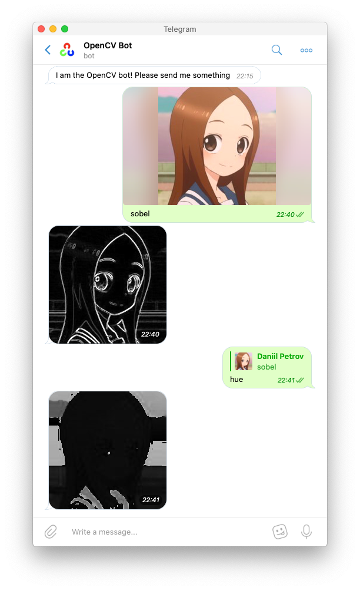

= OpenCV Telegram Bot

This is a simple Telegram bot that allows you to execute simple, common OpenCV functions and algorithms right in Telegram.
Uses link:https://github.com/python-telegram-bot/python-telegram-bot[python-telegram-bot].

== Usage

=== Direct message

link:https://t.me/opencvtbot[]

=== Add to group

Add the bot to a group.

link:https://t.me/opencvtbot[]

== Commands

Commands are in function - argument pairs

You can always find out the full list of commands by sending `/commands`

[source, MarkDown]
----
include::docs/commands_list[]
----

== Further reading on OpenCV functions:

link:https://docs.opencv.org/3.4/d6/d00/tutorial_py_root.html[OpenCV Documentation]

== Donate and Support
You can help support this by either making PRs, or also you can help me pay for hosting, as well as development expenses here: link:https://paypal.me/pools/c/8laitMcxKO[]

== Todo

- Add more command functionality
- Add more common functions
- Add interactive mode
