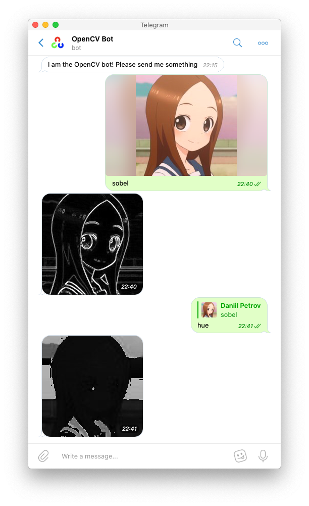

# OpenCV Telegram Bot
This is a simple Telegram bot that allows you to execute simple, common OpenCV functions and algorithms right in Telegram.
Uses [python-telegram-bot](https://github.com/python-telegram-bot/python-telegram-bot).

## Usage

### Direct message

Directly message the bot at [opencvtbot](https://t.me/opencvtbot).

### Add to group

Add the bot to a group.

[opencvtbot](https://t.me/opencvtbot)

### Commands

Commands are in function - argument pairs

You can always find out the full list of commands by sending `/commands`

`gray`
Converts given or replied to photo to greyscale

`hsv`
Converts given RGB image to HSV

`red`
Extracts red color channel from an RGB/BGR image and returns single channel image

`green`
Extracts green color channel from an RGB/BGR image and returns single channel image

`blue`
Extracts blue color channel from an RGB/BGR image and returns single channel image

`hue`
Extract hue channel from an HSV image and returns single channel image

`sat`
Extract saturation channel from an RGB/BGR image and returns single channel image

`val`
Extract value/luminance channel from an RGB/BGR image and returns single channel image

`blur 3`

Applies a blur kernel filter of size `w` x `h` over image (as provided in msg text with spaces)

`sharp` | `sharp 3`

Applies a sharp kernel filter over image (`n` times if specified, separated by a space, max = `10`)

`rotate` | `rotate cw | ccw` | `rotate left | right`

Rotate the image clockwise/anticlockwise by 90 degree increments

`norm`

Normalize the image

`sobel`

Calculate image gradients and draw as greyscale image

`histeq` | `contrast`

Perform histogram equalization of the image

`dft`

Discrete Fourier Transform

`thresh bin | bininv | trunc | tozero | tozeroinv`

Threshold the image using method of choice

### Further reading on OpenCV functions:

[OpenCV Docs](https://docs.opencv.org/3.4/d6/d00/tutorial_py_root.html)

## TODO

- Add more command functionality
- Add more common functions
- Add interactive mode
